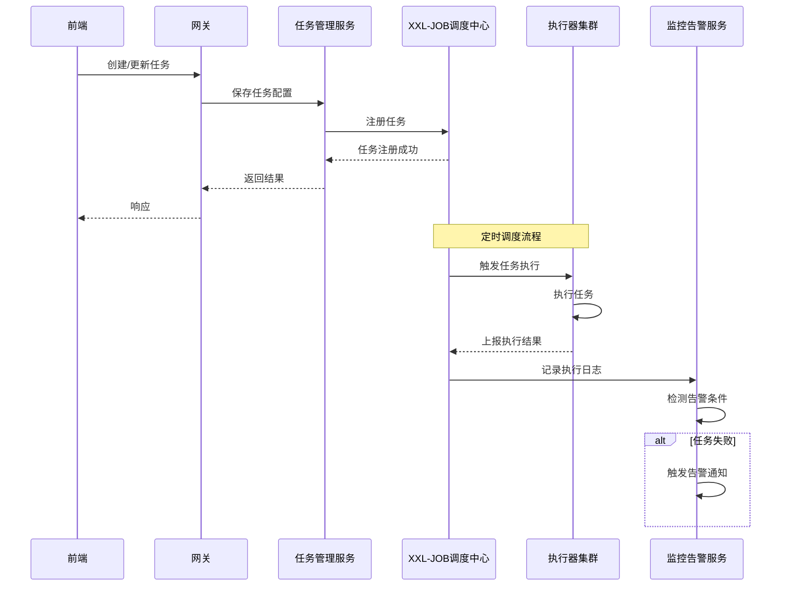
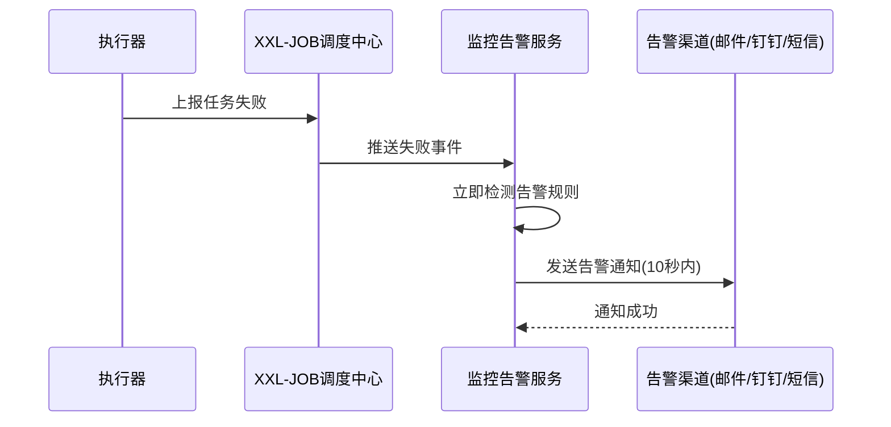
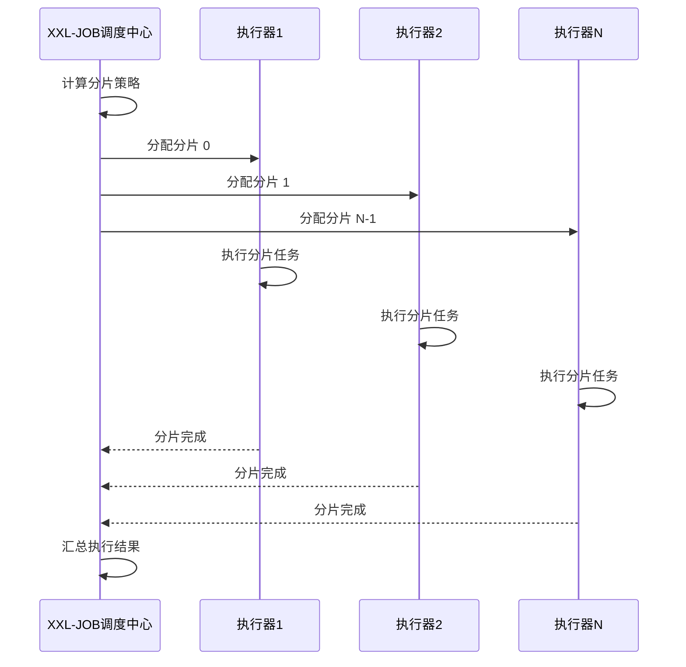

# 分布式定时任务调度平台 - 架构设计文档

## 1. 整体架构

### 1.1 架构风格

采用**微服务架构**，将调度中心独立为单独服务，后端业务服务作为统一入口，通过消息队列实现异步解耦，便于独立扩展和运维。

### 1.2 架构层次

```
┌─────────────────────────────────────────────────────────────────┐
│                        前端层 (Vue 3 + Element Plus)             │
│  ┌──────────────┐ ┌──────────────┐ ┌──────────────┐            │
│  │ 任务管理页   │ │ 监控仪表盘   │ │ 告警管理页   │            │
│  └──────────────┘ └──────────────┘ └──────────────┘            │
└───────────────────────────┬─────────────────────────────────────┘
                            │ HTTP/REST
                            ▼
┌─────────────────────────────────────────────────────────────────┐
│                        网关层 (Spring Gateway)                   │
│                     [认证、限流、路由转发]                        │
└───────────────────────────┬─────────────────────────────────────┘
                            │ HTTP/REST
         ┌──────────────────┼──────────────────┐
         ▼                  ▼                  ▼
┌──────────────┐   ┌──────────────┐   ┌──────────────┐
│  业务服务层  │   │ XXL-JOB      │   │  执行器集群  │
│ (Spring Boot)│   │   调度中心   │   │ (Executor)   │
└──────────────┘   └──────────────┘   └──────────────┘
         │                  │                  │
         └──────────────────┼──────────────────┘
                            │
         ┌──────────────────┼──────────────────┐
         ▼                  ▼                  ▼
┌──────────────┐   ┌──────────────┐   ┌──────────────┐
│   MySQL      │   │   Redis      │   │  RabbitMQ    │
│   数据库      │   │   缓存层     │   │   消息队列   │
└──────────────┘   └──────────────┘   └──────────────┘
```

## 2. 模块划分

### 2.1 模块职责

| 模块 | 职责说明 | 核心功能 |
|-----|---------|---------|
| **task-manager** | 任务管理模块 | 任务 CRUD、任务状态管理、任务触发 |
| **monitor-alarm** | 监控告警模块 | 任务执行监控、指标统计、多渠道告警 |
| **xxl-job-admin** | XXL-JOB 调度中心 | 任务调度、分片管理、日志追踪 |
| **xxl-job-executor** | XXL-JOB 执行器 | 任务执行、日志上报、结果回调 |
| **common** | 公共模块 | 工具类、异常处理、配置类 |

### 2.2 模块交互关系

```
前端 → 网关 → 任务管理服务 → XXL-JOB调度中心 → 执行器集群
                                   ↓
                              监控告警服务 → 告警通知
```

## 3. 核心流程

### 3.1 任务调度流程



### 3.2 告警触发流程



### 3.3 动态分片流程



## 4. 关键设计

### 4.1 缓存设计

| 缓存Key | 缓存内容 | 过期时间 | 更新策略 |
|--------|---------|---------|---------|
| task:info:{taskId} | 任务配置信息 | 5分钟 | 任务更新时主动删除缓存 |
| task:list:all | 任务列表 | 1分钟 | Redis Pub/Sub 通知所有节点失效 |
| stat:daily | 日统计数据 | 1小时 | 定时任务刷新 + 增量更新 |
| alarm:config | 告警配置 | 永久 | 配置更新时发布失效事件 |
| executor:online | 在线执行器列表 | 30秒 | 心跳触发更新 |

### 4.2 告警渠道设计

| 渠道类型 | 实现方式 | 适用场景 |
|---------|---------|---------|
| 邮件 | Spring Mail | 详细告警信息、历史追溯 |
| 钉钉 | 钉钉机器人API | 即时通知、群消息推送 |
| 短信 | 第三方短信服务 | 紧急告警、重要通知 |
| Webhook | HTTP回调 | 自定义集成、系统对接 |

## 5. 部署架构

### 5.1 容器化部署

```yaml
services:
  mysql:
    image: mysql:8.0
    volumes:
      - ./mysql/data:/var/lib/mysql
    environment:
      MYSQL_ROOT_PASSWORD: root
  
  redis:
    image: redis:7.0
    volumes:
      - ./redis/data:/data
  
  rabbitmq:
    image: rabbitmq:3.12-management
    volumes:
      - ./rabbitmq/data:/var/lib/rabbitmq
  
  xxl-job-admin:
    build: ./xxl-job-admin
    depends_on:
      - mysql
      - redis
  
  xxl-job-executor:
    build: ./xxl-job-executor
    depends_on:
      - xxl-job-admin
  
  backend:
    build: ./backend
    depends_on:
      - mysql
      - redis
      - rabbitmq
  
  frontend:
    build: ./frontend
    depends_on:
      - backend
```

### 5.2 网络拓扑

```
┌────────────────────────────────────────────────────────┐
│                    外网                                │
└──────────────────────────┬─────────────────────────────┘
                           │
                           ▼
┌────────────────────────────────────────────────────────┐
│                 Nginx (反向代理)                        │
└──────────────────────────┬─────────────────────────────┘
                           │
         ┌─────────────────┼─────────────────┐
         ▼                 ▼                 ▼
┌──────────────┐   ┌──────────────┐   ┌──────────────┐
│   Frontend   │   │   Backend    │   │   Gateway    │
│   (Vue 3)    │   │ (Spring Boot)│   │(Spring GW)   │
└──────────────┘   └──────────────┘   └──────────────┘
         │                 │                 │
         └─────────────────┼─────────────────┘
                           │
         ┌─────────────────┼─────────────────┐
         ▼                 ▼                 ▼
┌──────────────┐   ┌──────────────┐   ┌──────────────┐
│   MySQL      │   │   Redis      │   │  RabbitMQ    │
│   (8.0+)     │   │   (7.0+)     │   │  (3.12+)     │
└──────────────┘   └──────────────┘   └──────────────┘
                           │
                           ▼
                  ┌──────────────┐
                  │ XXL-JOB      │
                  │ Admin/Executor│
                  └──────────────┘
```