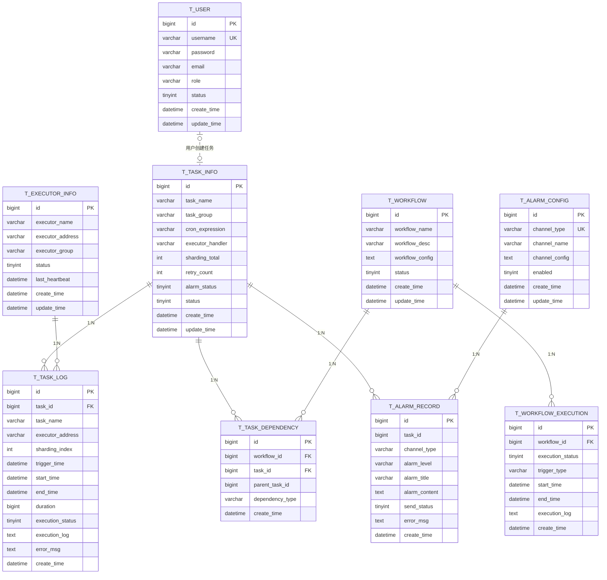

# 分布式定时任务调度平台 - 数据库设计文档

## 1. 数据库概述

本系统采用 MySQL 8.0+ 作为数据库存储引擎，主要包含任务配置、执行日志、告警记录、工作流、用户等核心数据表。

## 2. 数据库表设计

### 2.1 任务配置表 (`t_task_info`)

| 字段名 | 类型 | 约束 | 说明 |
|-------|------|------|------|
| id | BIGINT | PRIMARY KEY, AUTO_INCREMENT | 主键ID |
| task_name | VARCHAR(200) | NOT NULL | 任务名称 |
| task_group | VARCHAR(100) | NOT NULL | 任务分组 |
| cron_expression | VARCHAR(100) | NOT NULL | Cron表达式 |
| executor_handler | VARCHAR(200) | NOT NULL | 执行器处理器 |
| executor_param | VARCHAR(500) | | 执行参数 |
| sharding_total | INT | DEFAULT 1 | 分片总数 |
| sharding_param | VARCHAR(500) | | 分片参数 |
| retry_count | INT | DEFAULT 3 | 重试次数 |
| alarm_status | TINYINT | DEFAULT 1 | 告警状态(0关闭/1开启) |
| status | TINYINT | DEFAULT 0 | 任务状态(0停用/1启用) |
| description | VARCHAR(500) | | 任务描述 |
| create_time | DATETIME | DEFAULT CURRENT_TIMESTAMP | 创建时间 |
| update_time | DATETIME | ON UPDATE CURRENT_TIMESTAMP | 更新时间 |

**索引设计**：
- `idx_task_group` - 任务分组索引
- `idx_status` - 任务状态索引

### 2.2 任务执行日志表 (`t_task_log`)

| 字段名 | 类型 | 约束 | 说明 |
|-------|------|------|------|
| id | BIGINT | PRIMARY KEY, AUTO_INCREMENT | 主键ID |
| task_id | BIGINT | NOT NULL | 任务ID |
| task_name | VARCHAR(200) | NOT NULL | 任务名称 |
| executor_address | VARCHAR(200) | | 执行器地址 |
| sharding_index | INT | DEFAULT 0 | 分片索引 |
| sharding_param | VARCHAR(500) | | 分片参数 |
| trigger_time | DATETIME | NOT NULL | 触发时间 |
| start_time | DATETIME | | 开始时间 |
| end_time | DATETIME | | 结束时间 |
| duration | BIGINT | | 执行耗时(毫秒) |
| execution_status | TINYINT | DEFAULT 0 | 执行状态(0待执行/1成功/2失败) |
| execution_log | TEXT | | 执行日志 |
| error_msg | TEXT | | 错误信息 |
| create_time | DATETIME | DEFAULT CURRENT_TIMESTAMP | 创建时间 |

**索引设计**：
- `idx_task_id` - 任务ID索引
- `idx_trigger_time` - 触发时间索引
- `idx_execution_status` - 执行状态索引

### 2.3 用户表 (`t_user`)

| 字段名 | 类型 | 约束 | 说明 |
|-------|------|------|------|
| id | BIGINT | PRIMARY KEY, AUTO_INCREMENT | 主键ID |
| username | VARCHAR(100) | NOT NULL, UNIQUE | 用户名 |
| password | VARCHAR(200) | NOT NULL | 密码(BCrypt加密) |
| email | VARCHAR(200) | | 邮箱 |
| role | VARCHAR(50) | DEFAULT 'USER' | 角色(ADMIN/USER/GUEST) |
| status | TINYINT | DEFAULT 1 | 状态(0禁用/1启用) |
| create_time | DATETIME | DEFAULT CURRENT_TIMESTAMP | 创建时间 |
| update_time | DATETIME | ON UPDATE CURRENT_TIMESTAMP | 更新时间 |

**索引设计**：
- `idx_username` - 用户名索引
- `idx_status` - 状态索引

### 2.4 工作流表 (`t_workflow`)

| 字段名 | 类型 | 约束 | 说明 |
|-------|------|------|------|
| id | BIGINT | PRIMARY KEY, AUTO_INCREMENT | 主键ID |
| workflow_name | VARCHAR(200) | NOT NULL | 工作流名称 |
| workflow_desc | VARCHAR(500) | | 工作流描述 |
| workflow_config | TEXT | | 工作流配置JSON |
| status | TINYINT | DEFAULT 0 | 状态(0停用/1启用) |
| create_time | DATETIME | DEFAULT CURRENT_TIMESTAMP | 创建时间 |
| update_time | DATETIME | ON UPDATE CURRENT_TIMESTAMP | 更新时间 |

**索引设计**：
- `idx_workflow_name` - 工作流名称索引
- `idx_status` - 状态索引

### 2.5 工作流执行记录表 (`t_workflow_execution`)

| 字段名 | 类型 | 约束 | 说明 |
|-------|------|------|------|
| id | BIGINT | PRIMARY KEY, AUTO_INCREMENT | 主键ID |
| workflow_id | BIGINT | NOT NULL | 工作流ID |
| execution_status | TINYINT | DEFAULT 0 | 执行状态(0待执行/1执行中/2成功/3失败) |
| trigger_type | VARCHAR(50) | | 触发类型(MANUAL/AUTO) |
| start_time | DATETIME | | 开始时间 |
| end_time | DATETIME | | 结束时间 |
| execution_log | TEXT | | 执行日志 |
| create_time | DATETIME | DEFAULT CURRENT_TIMESTAMP | 创建时间 |

**索引设计**：
- `idx_workflow_id` - 工作流ID索引
- `idx_execution_status` - 执行状态索引
- `idx_start_time` - 开始时间索引

**外键约束**：
- `fk_workflow_execution_workflow_id` - FOREIGN KEY (workflow_id) REFERENCES t_workflow(id)

### 2.6 任务依赖表 (`t_task_dependency`)

| 字段名 | 类型 | 约束 | 说明 |
|-------|------|------|------|
| id | BIGINT | PRIMARY KEY, AUTO_INCREMENT | 主键ID |
| workflow_id | BIGINT | NOT NULL | 工作流ID |
| task_id | BIGINT | NOT NULL | 任务ID |
| parent_task_id | BIGINT | | 父任务ID |
| dependency_type | VARCHAR(50) | DEFAULT 'SUCCESS' | 依赖类型(SUCCESS/FAILURE/ALWAYS) |
| create_time | DATETIME | DEFAULT CURRENT_TIMESTAMP | 创建时间 |

**索引设计**：
- `idx_workflow_id` - 工作流ID索引
- `idx_task_id` - 任务ID索引
- `idx_parent_task_id` - 父任务ID索引

**外键约束**：
- `fk_task_dependency_workflow_id` - FOREIGN KEY (workflow_id) REFERENCES t_workflow(id)
- `fk_task_dependency_task_id` - FOREIGN KEY (task_id) REFERENCES t_task_info(id)

### 2.7 告警配置表 (`t_alarm_config`)

| 字段名 | 类型 | 约束 | 说明 |
|-------|------|------|------|
| id | BIGINT | PRIMARY KEY, AUTO_INCREMENT | 主键ID |
| channel_type | VARCHAR(50) | NOT NULL, UNIQUE | 渠道类型(EMAIL/WX_DING/DING_TALK) |
| channel_name | VARCHAR(200) | | 渠道名称 |
| channel_config | TEXT | | 渠道配置(JSON格式) |
| enabled | TINYINT(1) | DEFAULT 1 | 是否启用 |
| create_time | DATETIME | DEFAULT CURRENT_TIMESTAMP | 创建时间 |
| update_time | DATETIME | ON UPDATE CURRENT_TIMESTAMP | 更新时间 |

### 2.8 告警记录表 (`t_alarm_record`)

| 字段名 | 类型 | 约束 | 说明 |
|-------|------|------|------|
| id | BIGINT | PRIMARY KEY, AUTO_INCREMENT | 主键ID |
| task_id | BIGINT | | 任务ID |
| channel_type | VARCHAR(50) | NOT NULL | 告警渠道类型 |
| alarm_level | VARCHAR(20) | | 告警级别(INFO/WARN/ERROR) |
| alarm_title | VARCHAR(200) | NOT NULL | 告警标题 |
| alarm_content | TEXT | | 告警内容 |
| send_status | TINYINT | DEFAULT 0 | 发送状态(0待发送/1成功/2失败) |
| error_msg | TEXT | | 错误信息 |
| create_time | DATETIME | DEFAULT CURRENT_TIMESTAMP | 创建时间 |

**索引设计**：
- `idx_task_id` - 任务ID索引
- `idx_channel_type` - 渠道类型索引
- `idx_send_status` - 发送状态索引

### 2.9 执行器信息表 (`t_executor_info`)

| 字段名 | 类型 | 约束 | 说明 |
|-------|------|------|------|
| id | BIGINT | PRIMARY KEY, AUTO_INCREMENT | 主键ID |
| executor_name | VARCHAR(200) | NOT NULL | 执行器名称 |
| executor_address | VARCHAR(200) | NOT NULL | 执行器地址 |
| executor_group | VARCHAR(100) | NOT NULL | 执行器分组 |
| status | TINYINT | DEFAULT 1 | 在线状态(0离线/1在线) |
| last_heartbeat | DATETIME | | 最后心跳时间 |
| create_time | DATETIME | DEFAULT CURRENT_TIMESTAMP | 创建时间 |
| update_time | DATETIME | ON UPDATE CURRENT_TIMESTAMP | 更新时间 |

**索引设计**：
- `idx_executor_group` - 执行器分组索引
- `idx_status` - 在线状态索引

## 3. 表关系图



## 4. ER图说明

### 4.1 关系说明

| 关系 | 说明 |
|-----|------|
| T_TASK_INFO → T_TASK_LOG | 一个任务可以有多个执行日志 |
| T_TASK_INFO → T_TASK_DEPENDENCY | 一个任务可以在多个工作流中作为依赖节点 |
| T_TASK_INFO → T_ALARM_RECORD | 一个任务可以有多个告警记录 |
| T_WORKFLOW → T_WORKFLOW_EXECUTION | 一个工作流可以有多个执行记录 |
| T_WORKFLOW → T_TASK_DEPENDENCY | 一个工作流包含多个任务依赖关系 |
| T_ALARM_CONFIG → T_ALARM_RECORD | 一个告警配置可以产生多个告警记录 |
| T_EXECUTOR_INFO → T_TASK_LOG | 一个执行器可以执行多个任务 |
| T_USER → T_TASK_INFO | 一个用户可以创建多个任务 |

### 4.2 数据流向

```
用户认证 → 任务配置 → 任务调度 → 执行器执行 → 执行日志记录 → 告警检测 → 告警通知
                              ↓
                        工作流编排 → DAG执行 → 工作流执行记录
```

### 4.3 核心业务流程

1. **任务管理流程**：用户登录 → 创建任务 → 配置执行器 → 启动任务 → XXL-JOB调度 → 执行日志记录
2. **告警流程**：任务失败 → 告警检测 → 查询告警配置 → 发送通知 → 记录告警
3. **工作流流程**：创建工作流 → 配置任务依赖 → 执行工作流 → DAG拓扑排序 → 按依赖顺序执行任务

---

*文档更新时间：2026-05-13*
