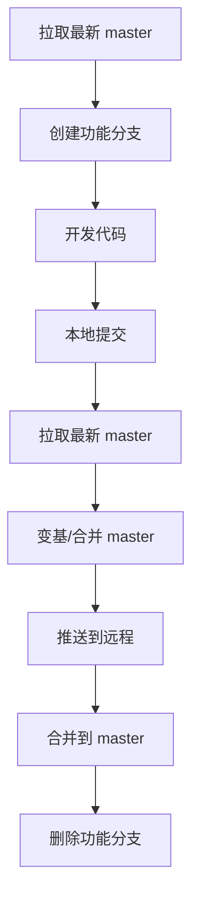

# Git 工作流规范

## 一、分支管理

### 1.1 分支策略
本项目采用 **单主干分支模式**（Trunk-Based Development），使用 `master` 作为唯一长期分支。

| 分支名 | 说明 | 生命周期 |
|--------|------|----------|
| `master` | 主分支，生产就绪代码 | 永久 |
| `feature/*` | 功能开发分支 | 临时 |
| `hotfix/*` | 紧急修复分支 | 临时 |

### 1.2 分支命名规范

**功能分支：**
```
feature/功能描述-日期
# 示例：
feature/audit-log-enhancement-20260514
```

**修复分支：**
```
hotfix/问题描述-日期
# 示例：
hotfix/fix-login-error-20260514
```

---

## 二、提交规范

### 2.1 Commit Message 格式
采用 Conventional Commits 规范：

```
<type>[optional scope]: <description>

[optional body]

[optional footer(s)]
```

### 2.2 Type 类型说明

| 类型 | 说明 |
|------|------|
| `feat` | 新功能 |
| `fix` | 修复 bug |
| `docs` | 仅文档变更 |
| `style` | 代码格式（不影响代码功能） |
| `refactor` | 重构（既不是新增功能，也不是修复 bug） |
| `perf` | 性能优化 |
| `test` | 测试相关 |
| `build` | 构建系统/依赖 |
| `ci` | CI 配置 |
| `chore` | 其他不修改 src 或 test 的变更 |

### 2.3 提交示例

**功能提交：**
```
feat: add operation enhancement features including audit log, executor group
```

**修复提交：**
```
fix: resolve login timeout issue in auth module
```

**文档提交：**
```
docs: add v0.6.0 iteration requirements document
```

---

## 三、代码推送流程

### 3.1 开发工作流



### 3.2 详细步骤

#### 步骤 1：同步最新代码
```bash
# 进入对应仓库（backend/frontend/deploy）
cd backend

# 确保在 master 分支
git checkout master

# 拉取最新代码
git pull origin master
```

#### 步骤 2：创建功能分支（可选，小改动可直接在 master）
```bash
# 创建并切换到功能分支
git checkout -b feature/your-feature-name
```

#### 步骤 3：开发并提交
```bash
# 查看变更
git status

# 添加文件
git add .

# 提交
git commit -m "feat: your commit message"
```

#### 步骤 4：同步远程（重要！）
```bash
# 再次拉取最新 master
git checkout master
git pull origin master

# 如果是在功能分支上开发
git checkout feature/your-feature-name
git rebase master  # 或 git merge master
```

#### 步骤 5：推送到远程
```bash
# 推送 master（如果直接在 master 开发）
git push origin master

# 或推送功能分支
git push origin feature/your-feature-name
```

---

## 四、多仓库同步

### 4.1 仓库结构
项目包含 3 个独立仓库：

| 仓库 | 目录 | 说明 |
|------|------|------|
| job-schedule-backend | `/backend` | Spring Boot 后端 |
| job-schedule-frontend | `/frontend` | Vue 3 前端 |
| job-schedule-deploy | `/deploy` | 部署配置和文档 |

### 4.2 同步推送脚本（推荐）

**Windows PowerShell：**
```powershell
# 保存为 push-all.ps1
$repos = @("backend", "frontend", "deploy")

foreach ($repo in $repos) {
    Write-Host "`n=== Pushing $repo ===" -ForegroundColor Green
    Set-Location $repo
    git status
    Set-Location ..
}

Write-Host "`nDone!" -ForegroundColor Green
```

**Linux/Mac Bash：**
```bash
# 保存为 push-all.sh
#!/bin/bash

REPOS=("backend" "frontend" "deploy")

for repo in "${REPOS[@]}"; do
    echo -e "\n=== Pushing $repo ==="
    cd $repo
    git status
    cd ..
done

echo -e "\nDone!"
```

### 4.3 手动同步步骤
当修改涉及多个仓库时，按以下顺序操作：

1. **backend**（后端逻辑）
2. **frontend**（前端界面）
3. **deploy**（文档和配置）

---

## 五、常见问题处理

### 5.1 推送冲突

**问题：**
```
! [rejected]        master -> master (fetch first)
```

**解决：**
```bash
# 1. 先拉取
git pull origin master

# 2. 处理冲突（如有）
# 编辑冲突文件

# 3. 标记解决
git add .

# 4. 继续变基或提交
git rebase --continue  # 如果之前用了 rebase
# 或
git commit -m "fix: resolve merge conflict"

# 5. 推送
git push origin master
```

### 5.2 撤销本地提交

**撤销最后一次提交但保留修改：**
```bash
git reset --soft HEAD~1
```

**撤销最后一次提交并丢弃修改：**
```bash
git reset --hard HEAD~1
```

### 5.3 查看提交历史

```bash
# 简洁查看
git log --oneline --graph

# 查看详细变更
git log -p

# 查看某个文件的变更历史
git log --follow -p filename
```

---

## 六、最佳实践

### 6.1 提交粒度
- 一个提交只做一件事
- 保持提交历史清晰可追溯
- 避免巨型提交（超过 500 行变更建议拆分）

### 6.2 代码质量
- 提交前确保代码能正常编译/运行
- 后端：运行 `mvn clean compile`
- 前端：运行 `npm run build`
- 不要提交调试代码（console.log、临时注释等）

### 6.3 推送频率
- 建议每天至少推送一次（下班后）
- 完成一个功能点后立即推送
- 避免本地堆积大量未推送提交

### 6.4 分支清理
- 功能合并后及时删除本地和远程分支
```bash
# 删除本地分支
git branch -d feature/your-feature

# 删除远程分支
git push origin --delete feature/your-feature
```

---

## 七、Git 配置建议

### 7.1 用户信息配置
```bash
git config --global user.name "Your Name"
git config --global user.email "your.email@example.com"
```

### 7.2 换行符处理（Windows）
```bash
git config --global core.autocrlf true
```

### 7.3 默认分支名
```bash
git config --global init.defaultBranch master
```

---

*文档创建时间：2026-05-14*
